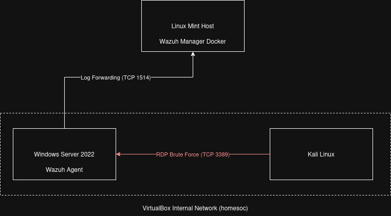
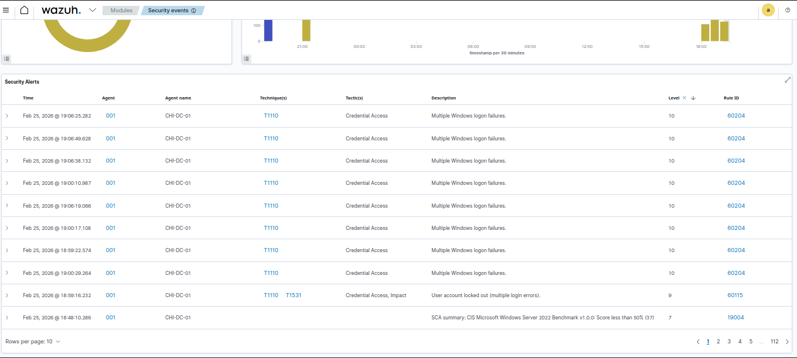
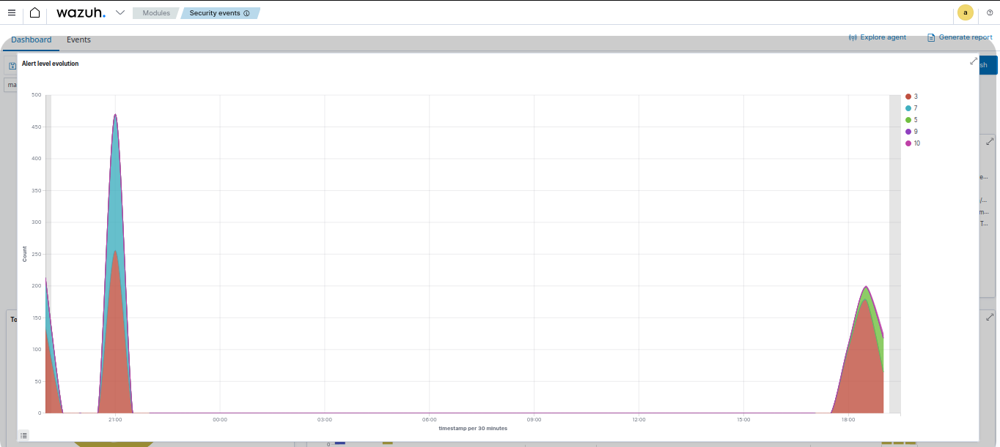
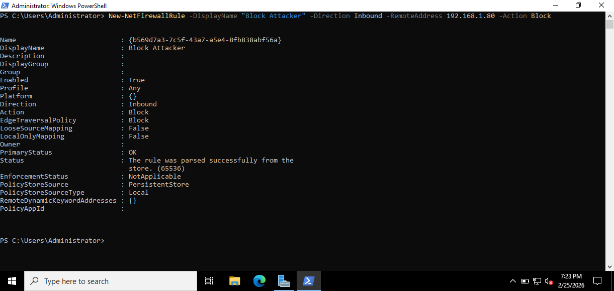

# Home Lab: Network Security & SIEM Implementation


**Author:** Jesus Gamez
**Tools Used:** Linux Mint · Wazuh 4.7.4 · VirtualBox · Hydra · Windows Firewall · Docker

---

## Table of Contents

- [Project Overview](#-project-overview)
- [Architecture & Network Diagram](#-architecture--network-diagram)
- [Skills Demonstrated](#-skills-demonstrated)
- [Attack Scenario](#-scenario-the-brute-force-attack)
- [Detection Results](#-detection-results)
- [Repository Structure](#-repository-structure)
- [Quick Start](#-quick-start)
- [Lessons Learned](#-lessons-learned)
- [Troubleshooting](#-troubleshooting)
- [Resources](#-resources)

---

## Project Overview

This project documents the end-to-end build of a home-based Security Operations Center (SOC) using commodity hardware. Running on a repurposed Linux Mint laptop, the environment simulates realistic enterprise attack scenarios and demonstrates live threat detection through a self-hosted SIEM.

The core objective was to bridge theory and practice: configure a real SIEM, generate authentic attack telemetry, write custom detection rules, and respond to incidents — all without cloud spend.

**Key outcomes:**
- Deployed Wazuh 4.7.4 via Docker on constrained hardware
- Ingested Windows Security Event logs from a monitored endpoint
- Detected RDP brute-force attacks with a custom correlation rule (Event ID 4625)
- Blocked attacker IPs via automated PowerShell firewall rules
- Resolved multiple real-world infrastructure issues documented in the [Troubleshooting](#-troubleshooting) section

---

## Architecture & Network Diagram

> **Diagram:** See [`./assets/diagram.png`](./assets/diagram.png)



| Component | Role | IP |
|---|---|---|
| Linux Mint Host | SIEM Host (Docker) | 192.168.1.74 |
| Wazuh 4.7.4 | SIEM — Indexer, Manager, Dashboard | 192.168.1.74 |
| Windows Server 2022 | Monitored Target (Wazuh Agent) | DHCP / Bridged |
| Kali Linux | Attacker | Internal Network |

**Network Configuration:**
- **Bridged Adapter** (`wlp0s20f3`): Windows Server → Host machine for Wazuh agent communication
- **Internal Network** (`homesoc`): Kali Linux → Windows Server for isolated attack traffic

---

## Skills Demonstrated

| Category | Skills |
|---|---|
| **Log Ingestion** | Configured Wazuh agent on Windows Server 2022 to forward Security Event logs to the SIEM manager |
| **Threat Detection** | Authored custom Wazuh correlation rules targeting Event ID 4625 with frequency and time-window thresholds |
| **Incident Response** | Identified attacker source IP from SIEM alerts, blocked via PowerShell `New-NetFirewallRule` |
| **System Hardening** | Applied CIS-aligned Windows Firewall policies; restricted RDP to internal network only |
| **Virtualization** | Managed dual-NIC VirtualBox topology (Bridged + Internal Network) on legacy hardware |
| **Containerization** | Deployed and tuned multi-service Docker Compose stack on low-RAM host |
| **Troubleshooting** | Resolved Docker Compose V1/V2 incompatibility, SSL cert generation bugs, and agent version mismatches |

---

## Scenario: "The Brute Force Attack"

### Phase 1 — Reconnaissance & Attack

Kali Linux (attacker VM on the isolated `homesoc` internal network) targeted the Windows Server 2022 RDP service with a credential brute-force:

```bash
hydra -l Administrator -P /usr/share/wordlists/rockyou.txt rdp://[TARGET_IP] -t 4 -V
```

### Phase 2 — Detection

Wazuh triggered a **Level 10 alert** after detecting 5 or more failed logon events (Event ID 4625) within a 60-second window — matching the custom rule in [`./configs/local_rules.xml`](./configs/local_rules.xml).

> **Screenshot:** SIEM Alert Dashboard
>
> 

> **Screenshot:** Event ID 4625 in Windows Event Viewer
>
> 

### Phase 3 — Response

Source IP identified from the Wazuh alert. Blocked at the Windows Firewall level using the response script:

```powershell
.\configs\windows-firewall-block.ps1 -AttackerIP "10.0.2.15"
```

> **Screenshot:** Firewall rule applied
>
> 

---

## Detection Results

| Alert Field | Value |
|---|---|
| Rule ID | 100002 |
| Rule Description | Multiple RDP Failed Logins (Brute Force Attempt) |
| Alert Level | 10 |
| Event ID | 4625 |
| Threshold | 5 events / 60 seconds |
| MITRE Technique | T1110.001 — Brute Force: Password Guessing |

---

## Repository Structure

```
home-soc-lab/
├── README.md                         # This file
├── SETUP.md                          # Full environment setup guide
├── docker-compose.yml                # Wazuh 4.7.4 single-node deployment
├── .gitignore
├── assets/
│   └── diagram.png                   # Network architecture diagram
├── screenshots/
│   ├── siem-alert.png                # Wazuh dashboard alert
│   ├── event-viewer-4625.png         # Windows Event Viewer - failed logins
│   └── firewall-block.png            # PowerShell firewall rule output
├── configs/
│   ├── local_rules.xml               # Custom Wazuh detection rule (RDP brute force)
│   ├── ossec.conf                    # Wazuh agent configuration (Windows Server)
│   └── windows-firewall-block.ps1    # Standalone attacker IP block script
└── scripts/
    ├── setup-agent.ps1               # Automated Wazuh agent install (Windows)
    └── harden-windows.ps1            # Windows hardening — firewall, audit policy, RDP restriction
```

---

## Quick Start

### Prerequisites

- Docker Engine + Docker Compose V2
- VirtualBox 7.2.4
- Windows Server 2022 ISO
- Kali Linux ISO
- Minimum 8 GB RAM on host (16 GB recommended)

### 1. Clone the Repository

```bash
git clone https://github.com/yourusername/home-soc-lab.git
cd home-soc-lab
```

### 2. Generate Wazuh SSL Certificates

> **Warning:** This step must be completed **before** starting the containers. See [Troubleshooting](#-troubleshooting) for the directory-vs-file certificate bug.

```bash
docker compose -f generate-indexer-certs.yml run --rm generator
```

### 3. Start the Wazuh Stack

```bash
docker compose up -d
```

Access the dashboard at `https://localhost` (default credentials: `admin` / `SecretPassword`).

### 4. Deploy Agent to Windows Server

Copy `scripts/setup-agent.ps1` to the Windows Server and run in an elevated PowerShell session:

```powershell
Set-ExecutionPolicy Bypass -Scope Process
.\scripts\setup-agent.ps1
```

### 5. Harden the Windows Server

```powershell
.\scripts\harden-windows.ps1 -AttackerIP "10.0.2.15"
```

---

## Lessons Learned

- **Version Matching:** Wazuh agent and manager must be on identical versions. A version mismatch causes silent connection refusal — no error on the agent side, nothing in manager logs. Always download the MSI directly from `packages.wazuh.com` matching the exact manager version.

- **Network Configuration:** Bridged Adapter provides direct layer-2 access to the host's physical network, making it far more reliable than Host-Only for host-to-VM communication in home labs. Host-Only requires additional manual routing that can break across reboots.

- **Certificate Generation:** Wazuh's `generate-indexer-certs.yml` must complete successfully before launching the main stack. The Opensearch indexer will fail with a cryptic TLS error if certs are missing or malformed.

- **Noise Filtering:** System logs from Windows generate substantial volume. Custom Wazuh rules with appropriate frequency thresholds prevent alert fatigue while catching genuine attacks.

- **Resource Management:** Running VMs headless (`VBoxManage startvm "VM Name" --type headless`) frees significant RAM on the host. Combine with Wazuh's `bootstrap.memory_lock` setting to prevent indexer memory swapping.

---

## Troubleshooting

Real issues encountered and resolved during this build.

---

### Docker Compose V1 Incompatibility with Python 3.12

**Symptom:** Running `docker-compose up` (V1 syntax) failed with a Python import error on Linux Mint with Python 3.12 installed.

```
AttributeError: module 'collections' has no attribute 'Callable'
```

**Root Cause:** Docker Compose V1 is written in Python 2/3.9-era code. Python 3.12 removed several deprecated `collections` aliases that V1 relied on.

**Fix:** Uninstall V1 and install Docker Compose V2 as a Docker CLI plugin:

```bash
sudo apt-get remove docker-compose
sudo apt-get install docker-compose-plugin
docker compose version  # note: no hyphen in V2
```

---

### Wazuh SSL Certificates Generated as Directories Instead of Files

**Symptom:** After running `generate-indexer-certs.yml`, the `certs/` directory contained empty subdirectories instead of `.pem` and `.key` files. The Wazuh indexer container crashed on startup with a TLS handshake error.

**Root Cause:** Docker volume mount conflict — when the target path inside the container was pre-created as a directory by a previous failed run, Docker bound a directory to the expected file path instead of creating the file.

**Fix:**

```bash
# Remove all cert artifacts from the previous failed run
sudo rm -rf ./config/wazuh_indexer_ssl_certs/
sudo rm -rf ./config/wazuh_dashboard_ssl_certs/

# Re-run the cert generator from a clean state
docker compose -f generate-indexer-certs.yml run --rm generator
```

Verify the output contains `.pem` and `.key` files, not directories:

```bash
ls -la ./config/wazuh_indexer_ssl_certs/
```

---

### VirtualBox Host-Only Networking Not Routing to Host

**Symptom:** The Wazuh agent on Windows Server could not reach the host machine at `192.168.1.74` when using a Host-Only adapter. `ping 192.168.1.74` timed out from inside the VM.

**Root Cause:** VirtualBox Host-Only networking creates an isolated virtual network between the host and VMs. It does not bridge to the host's physical NIC (`wlp0s20f3`), so the VM operates on a separate subnet and cannot directly reach the host's LAN IP.

**Fix:** Switch the Windows Server VM's NIC from Host-Only to **Bridged Adapter**, selecting `wlp0s20f3` as the physical interface. The VM will receive a DHCP address on the same LAN subnet as the host and can communicate directly.

VirtualBox settings path: `VM Settings → Network → Adapter 1 → Bridged Adapter → wlp0s20f3`

---

### Wazuh Agent/Manager Version Mismatch

**Symptom:** The Wazuh agent on Windows Server showed status `Disconnected` in the dashboard. No alerts were generated. The agent Windows service appeared to start successfully.

**Root Cause:** The installed agent version (e.g., 4.7.2 from a cached download or wrong repository) did not match the manager version (4.7.4). Wazuh enforces strict version compatibility and silently drops connections from mismatched agents.

**Fix:** Download the exact matching MSI directly from the Wazuh package repository:

```
https://packages.wazuh.com/4.x/windows/wazuh-agent-4.7.4-1.msi
```

Uninstall any existing agent via Windows Add/Remove Programs, then run `setup-agent.ps1` which fetches this specific URL. After reinstalling, confirm the agent version in the Wazuh dashboard matches the manager under **Agents → [Agent Name] → Version**.

---

## Resources

- [Wazuh Documentation](https://documentation.wazuh.com/current/index.html)
- [Wazuh Docker Deployment Guide](https://documentation.wazuh.com/current/deployment-options/docker/wazuh-container.html)
- [Windows Event ID Reference — 4625](https://learn.microsoft.com/en-us/windows/security/threat-protection/auditing/event-4625)
- [MITRE ATT&CK T1110.001 — Brute Force](https://attack.mitre.org/techniques/T1110/001/)
- [Wazuh Rules Reference](https://documentation.wazuh.com/current/user-manual/ruleset/ruleset-xml-syntax/rules.html)
- [VirtualBox Network Modes Explained](https://www.virtualbox.org/manual/ch06.html)

---

*Built for learning. Documented for the community.*
